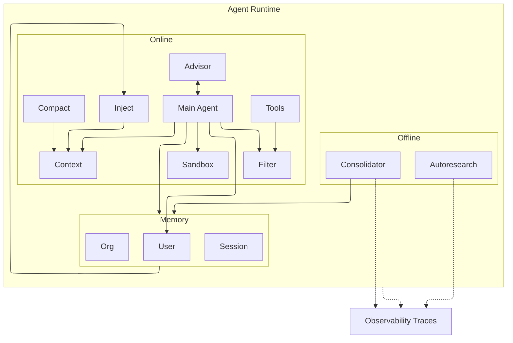

```mermaid
---
config:
  layout: elk
---
flowchart TB
    %%===== SYSTEM OVERVIEW =====%%
    subgraph System["Agent Runtime"]
        class System sysColor

        %%===== MEMORY =====%%
        subgraph Memory["Memory"]
            class Memory memColor
            User["User"]
            Session["Session"]
            Org["Org"]
        end

        %%===== OFFLINE COMPONENTS =====%%
        subgraph Offline["Offline"]
            class Offline offlineColor
            Consolidator["Consolidator"]
            Autoresearch["Autoresearch"]
        end

        %%===== ONLINE COMPONENTS =====%%
        subgraph Online["Online"]
            class Online onlineColor
            Advisor["Advisor"]
            MainAgent["Main Agent"]
            Context["Context"]
            Inject["Inject"]
            Compact["Compact"]
            Filter["Filter"]
            Tools["Tools"]
            Sandbox["Sandbox"]
        end
    end

    %%===== CONNECTIONS =====%%
    Advisor <--> MainAgent
    MainAgent --> Context & Filter & Sandbox & Memory
    MainAgent --> User
    Tools --> Filter
    Inject --> Context
    Compact --> Context
    Memory --> Inject
    Consolidator --> Memory
    Consolidator -.-> Traces["Observability Traces"]
    Autoresearch -.-> Traces
    System -.-> Traces

    %%===== STYLE DEFINITIONS =====%%
    classDef sysColor stroke:#374151,fill:#f9fafb
    classDef onlineColor stroke:#38bdf8,fill:#f0f9ff
    classDef offlineColor stroke:#fb923c,fill:#fff7ed
    classDef memColor stroke:#a78bfa,fill:#f5f3ff
```